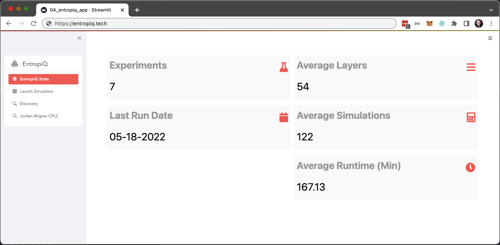

<p align="center">
  
</p>

# Welcome

The acceleration of quantum hardware and software development is making quantum computing poised to become one of the most important technological innovations in the 21st century. Given the significant challenges remaining before surpassing the current NISQ era, one flourishing area of development is the intersection of high-performance computing for simulating many-body quantum mechanical systems so that *classical in-silico* simulations enable rapid prototyping and experimentation.

Now, entanglement entropy is a key quantity in quantum physics that captures how much quantum information is shared between parts of a system. Analyzing and modeling the characteristics and behavior of entanglement entropy under different system sizes, gates, and measurement regimes -- i.e., the so-called area-to-volume law phase transitions encoded by entanglement entropy --  is fundamentally important. 

**EntropiQ** is a framework and application that enables researchers to more easily design, run and manage large-scale simulations of many-body quantum mechanical systems using Tensor Networks for running, managing, and analyzing experiments of entanglement entropy in large-scale systems.

---
## EntropiQ Components

<p align="center">
  
</p>

There are three components of EntropiQ:
- Many-body quantum system simulation pipeline templates in Julia
  - Currently seeded with both brick-layer design and completely packed loop model with crossings (CPLC) design
- AWS Postgres Database for quantum simulation data and metadata management
  - Schema for managing experiment metadata, high-level simulation results, and low-level state and entropy tracking
- Streamlit Application
  - Flexible experimental design, including: system size, gates, measurement types and rates, circuit depth and entropy calculation customization.
  - High and low-level exploratory data analysis of entanglement entropy, runtime analysis, and state probability distribution evolution animations
  - Platform statistics


<p align="center">
  
</p>


---

## Simulation of Many-body Quantum Systems

The computational challenge of simulating many-body quantum systems is the exponential increase in size of the Hilbert space:

<div align="center">
  
</div>

There are many computational approaches for simulating many-body systems, such as: exact diagonalization of the quantum Hamiltonian, series expansion techniques, quantum Monte Carlo algorithms, continuous unitary transformations, coupled cluster methods, and density functional theory (DFT). These methods have various limitations that span both computational (computer memory) and with mathematical accuracy due to approximations that must be made.

An alternative method, Matrix Product States (MPS) is a powerful and unique approach limited only by the nature of the entanglement of the system (in fact, the paper explicitly warns it's a method for "slightly entangled" or "conveniently restricted" systems). Two excellent introductions to tensor networks and MPS are provided in the references.

A tensor network is a diagrammatic method for combining many low-order tensors into one higher-order "composite tensor." Tensors are represented by objects (circles, triangles, squares, and rectangles are most common), and the legs emanating from the objects represent the indices of the tensor and therefore its local rank. In a diagram, the number of satellite legs (that don't connect to an object) can be added to determine the rank (or "order") of the composite tensor.


The MPS translates the original state vector into a local representation as follows:

  

On the LHS, \(\ket{\Psi}\) is of length \(2^n\) and \(c_{i_{1}...i_{n}}\) are \(2^n\) complex numbers (vs. \(2n\) amplitudes if it were a product state). On the RHS, the \(s_i\) are basis states (i.e. for qubits \(s_i \in \{0,1\}\)), and the \(A_i^{s_i}\) are square matrices of local dimension \(\chi\), which is the maximal Schmidt rank (from the Schmidt decomposition of \(\ket{\Psi}\)) over all possible bipartite splittings of the \(n\) qubits.

As a small concrete example, consider a 2-qubit system with maximum entanglement (i.e., a "Bell State" or "EPR pair"). We begin with both qubits in \(\ket{0}\). First, apply a Hadamard to the first qubit, and then follow that with a 2-qubit CNOT gate between the two qubits, resulting in:

<div align="center">
  
</div>

This is a *maximally entangled* state living in \(\mathbb{C}^4\), meaning given the state of the first qubit, the state of the second qubit is also known definitively. The MPS representation is:

<div align="center">
  
</div>

We arrive at this equation by iteratively splitting the system into two parts (one index at a time), creating a left and right hand side (lower-order tensors). At each iteration, we perform a Singular Value Decomposition (SVD), and then finally contract the \(\lambda^{i}\) matrices into their left local tensors \(M^{i}\). This forms the tensor network of \(A^{i}\)'s, which is the MPS, as shown below:


---

### Simulation Design

The system architecture is a one-dimensional chain of qubits that undergo the so-called "brick-layer" evolution illustrated below. Here, nearest-neighbor gates and measurements are applied in an alternating even/odd pattern resembling bricks. Unary or binary gates (such as random unitaries or Clifford Gates) and projective measurements are applied in this alternating pattern, and at a certain depth (number of layers), the resulting entanglement entropy is quantified. This process is repeated a specified number of simulations for each system-size and measurement rate, and the average entanglement entropy across simulations is computed.


The pseudo-code for a simulation run is as follows:

```python
for s in n_simulations:
  for q in system_sizes:
    for r in measurement_rates:
      for l in number_of_layers:
        for i in qubit_index_space:
          if (either i and l are both odd or both even):
            apply gate to qubits (i, i+1)
            if r > rand(0, 1):
                apply measurement to qubits (i, i+1)
      compute_entropy(ψ)
```

The 2-qubit gates are selected randomly from either Haar random unitaries or Clifford gates. After all layer iterations, the Von Neumann entropy is calculated based on the final MPS state of \(\Psi\) using Singular Value Decomposition (SVD) of a bi-partition of the system:

<div align="center">
  
</div>

Here, \(\lambda_{i} = \sum_{i,i}^2\) is the square of the \(i\)-th singular value from the S tensor (in the Schmidt basis) from SVD. Thus, \(\lambda_{i}\) is the probability of observing state \(i\).


# Relevant Papers

## Quantum System Experimental Design
[Bricklayer Design - "Quantum Zeno Effect and the Many-body Entanglement Transition"](https://arxiv.org/pdf/1808.06134.pdf)

[Entanglement area law in superfluid 4He](https://www.nature.com/articles/nphys4075)

[Simulating Clifford's - "Hadamard-free circuits expose the structure of the Clifford group"](https://arxiv.org/abs/2003.09412)

[Measurement Protected Quantum Phases](https://arxiv.org/pdf/2004.09509.pdf)

## Tensor Networks
[This site is a resource for tensor network algorithms, theory, and software.](https://tensornetwork.org/)

[Quantum Tensor Networks in a Nutshell](https://arxiv.org/pdf/1708.00006.pdf)

[The density-matrix renormalization group in the age of matrix product states](https://arxiv.org/abs/1008.3477)

[Hand-waving and Interpretive Dance: An Introductory Course on Tensor Networks](https://arxiv.org/pdf/1603.03039.pdf)

[Matrix Product State Based Algorithms for Ground States and Dynamics](https://qdev.nbi.ku.dk/student_theses/RGawatz_Msc.pdf)

[ITensors - very good article on measurement of local operators](http://itensor.org/docs.cgi?page=formulas/measure_mps&vers=julia)

[A Practical Introduction to Tensor Networks: Matrix Product States and Projected Entangled Pair States](https://arxiv.org/pdf/1306.2164.pdf)

[Garnet Chan "Matrix product states, DMRG, and tensor networks" (Part 1 of 2)](https://www.youtube.com/watch?v=Q8bFmV6tHBs)

[Garnet Chan "Matrix product states, DMRG, and tensor networks" (Part 2 of 2)](https://www.youtube.com/watch?v=s37tvvrjlto)

[MPS Examples](https://physics.stackexchange.com/questions/266587/examples-of-matrix-product-states)

[Qiskit MPS](https://qiskit.org/documentation/stable/0.24/tutorials/simulators/7_matrix_product_state_method.html)

## Entanglement Entropy

[Quantum Entropies](http://www.scholarpedia.org/article/Quantum_entropies)

> "von Neumann entropy is a limiting case of the Rényi entropy lim α→1 Sα(ρ) = S(ρ) Given a family of entropies {Sα(ρ)}α, where α is some index, the entropies are monotonic in α∈ℝ" (see [here](https://en.wikipedia.org/wiki/Von_Neumann_entropy)).

Entanglement Entropy via the partial trace:
> "Among physicists, this is often called "tracing out" or "tracing over" W to leave only an operator on V in the context where W and V are Hilbert spaces associated with quantum systems (see [here](https://en.wikipedia.org/wiki/Partial_trace#:~:text=In%20linear%20algebra%20and%20functional,is%20an%20operator%2Dvalued%20function))."

[Partial Trace](http://www.fmt.if.usp.br/~gtlandi/04---reduced-dm-2.pdf)

[Partial Trace Wikipedia](https://en.wikipedia.org/wiki/Partial_trace)


## Misc Articles

[MSFT Azure Article - very good Pauli measurement operations](https://docs.microsoft.com/en-us/azure/quantum/concepts-pauli-measurements)

[Area Law](https://www.nist.gov/system/files/documents/itl/math/slides_fernando_brandao.pdf)

[What is the difference between general measurement and projective measurement?](https://physics.stackexchange.com/questions/184524/what-is-the-difference-between-general-measurement-and-projective-measurement)

[Validating quantum-classical programming models with tensor network simulations](https://arxiv.org/abs/1807.07914)

[Universal Quantum Simulators](https://www.science.org/doi/10.1126/science.273.5278.1073)


# Step-By-Step Onboarding

Create a `db_creds.env` file in the root folder with the following:
```
POSTGRES_DB_USERNAME=
POSTGRES_DB_PASSWORD=
POSTGRES_DB_URL=
POSTGRES_DB_PORT=5432
POSTGRES_DB_NAME=postgres
```

# Helpful Links and Tips

## Julia
To install [Julia](https://julialang.org/) on Mac:
```
brew install --cask julia
brew update && brew upgrade julia
```

Add Julia to Path
> '/Applications/Julia-1.7.app/Contents/Resources/julia/bin/julia'
> ln -fs "/Applications/Julia-1.7.app/Contents/Resources/julia/bin/julia" /usr/local/bin/julia
> or, export PATH="$PATH:/path/to/<Julia directory>/bin" or ~/.bash_profile

[Julia Docs are here.](https://docs.julialang.org/en/v1/)

[Julia Intro](https://syl1.gitbook.io/julia-language-a-concise-tutorial/language-core/getting-started)

[Embed Julia in Python](https://towardsdatascience.com/how-to-embed-your-julia-code-into-python-to-speed-up-performance-e3ff0a94b6e)

[How to call Julia code from Python](https://blog.esciencecenter.nl/how-to-call-julia-code-from-python-8589a56a98f2)

[AWS Lambda Maker for Julia](https://juliahub.com/ui/Packages/LambdaMaker/oGeH6/0.1.0)

[Pluto for interactive Julia Dashboards](https://github.com/fonsp/Pluto.jl)

[LambdaMaker.jl](https://juliahub.com/ui/Packages/LambdaMaker/oGeH6/0.1.0)

[Genie is a full-stack web framework that provides a streamlined and efficient workflow for developing modern web applications. It builds on Julia's strengths (high-level, high-performance, dynamic, JIT compiled), exposing a rich API and a powerful toolset for productive web development.](https://github.com/GenieFramework/Genie.jl)

[Deploying a Julia API with Genie](https://genieframework.github.io/Genie.jl/dev/guides/Simple_API_backend.html)

[Genie Documentation](https://geniejl.readthedocs.io/en/latest/)

[Graphs.jl](https://juliagraphs.org/Graphs.jl/stable/generators/)

## ITensors and PastaQ

- [ITensor Paper](https://arxiv.org/pdf/2007.14822.pdf)
- [PastaQ GitHub](https://github.com/GTorlai/PastaQ.jl)

Starter code to understand how to run simulations using ITensor and PastaQ was graciously provided [here](https://raw.githubusercontent.com/GTorlai/PastaQ.jl/master/examples/11_monitored_circuit.jl).

Install PastaQ:

```
julia> ]
pkg> add PastaQ
julia> import Pkg; Pkg.add("ITensors"); Pkg.add("StatsBase")
julia> Pkg.add(Pkg.PackageSpec(;name="PastaQ", version="0.0.18"))
```

After installing Itensor and PastaQ, you must run this `julia> using Pkg; Pkg.update()`.
Add to `~/.zshrc`:

```
export JULIA_NUM_THREADS=4
```

## Atom Editor

[juno-makes-writing-julia-awesome](https://towardsdatascience.com/juno-makes-writing-julia-awesome-f3e1baf92ea9)

[Juno Update](https://docs.junolab.org/stable/man/update/)
```
pkg> up Atom Juno

```

## Julia help docs
- https://docs.julialang.org/en/v1/manual/style-guide/#bang-convention
- https://docs.julialang.org/en/v1/manual/control-flow/
- https://docs.julialang.org/en/v1/manual/variables-and-scoping/
- https://sodocumentation.net/julia-lang
- https://github.com/bkamins/Julia-DataFrames-Tutorial/
- https://www.ahsmart.com/pub/data-wrangling-with-data-frames-jl-cheat-sheet/
- https://www.reddit.com/r/Julia/comments/9p3ttr/clearing_workspace_atom/
[Julia Data Format like HDF5](https://github.com/JuliaIO/JLD.jl)

## Embed Julia into Python
- https://towardsdatascience.com/how-to-embed-your-julia-code-into-python-to-speed-up-performance-e3ff0a94b6e
- https://syl1.gitbook.io/julia-language-a-concise-tutorial/language-core/interfacing-julia-with-other-languages

### Online help for Streamlit and Julia Integration
[StackOverflow](https://stackoverflow.com/questions/71726946/calling-julia-from-streamlit-app-using-pyjulia)

[Streamlit Issues](https://github.com/streamlit/streamlit/issues/4585)

[PyJulia Issues](https://github.com/JuliaPy/pyjulia/issues/492)

# Thanks

This could not have been done without the generous support provided by the [ITensors](https://arxiv.org/pdf/2007.14822.pdf) and [PastaQ](https://github.com/GTorlai/PastaQ.jl) package developers, Matt and Giacomo. These are the two powerhouse packages used by EntropiQ.
